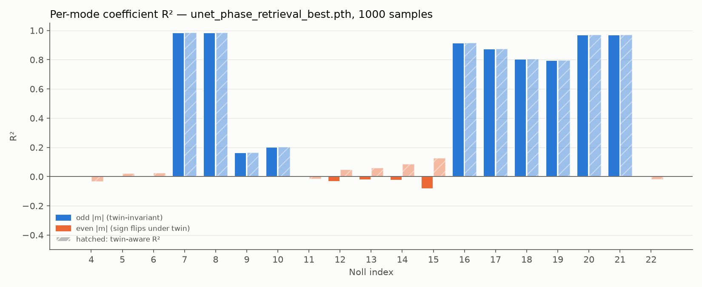
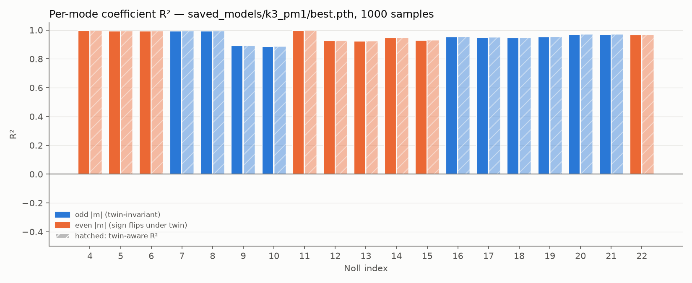
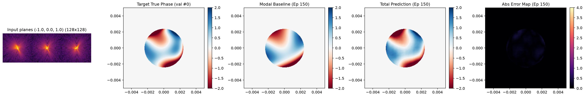
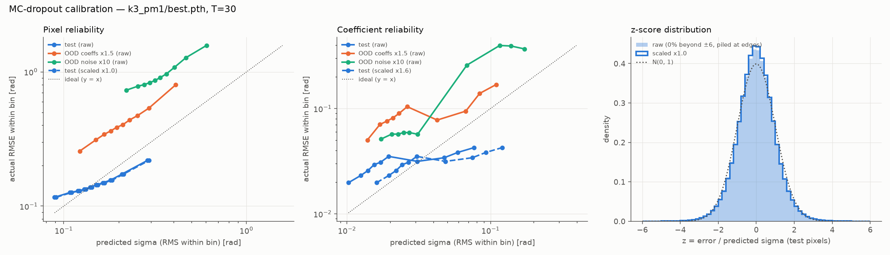

# EUV Phase Retrieval

Recovering the aberrated pupil phase of an EUV optical system from far-field intensity images, with a differentiable physics simulator, a classical gradient-descent solver, and a physics-informed neural network with calibrated uncertainty.

**Headline result.** With three phase-diversity images, the network recovers all 19 Zernike modes (Noll 4–22) with R² of 0.89–1.00 and a median pupil-phase error of **0.144 rad RMS** (the true phase has 1.27 rad RMS). A single in-focus image cannot do this at all: the sign of every centrosymmetric mode is fundamentally ambiguous, and the original single-image model learned to predict zero for those modes.

| | Single in-focus image (original) | 3 diversity planes (`k3_pm1`) |
|---|---|---|
| Mean R², even-\|m\| modes (defocus, astigmatism, spherical, ...) | −0.02 | **0.963** |
| Mean R², odd-\|m\| modes (coma, trefoil, ...) | 0.77 | **0.950** |
| Median phase RMSE in the pupil | 1.12 rad | **0.144 rad** |
| Predictions closer to the twin −φ(−r) than to the truth | 51.6 % (chance) | **0 %** |
| MC-dropout coverage of ±1σ / ±2σ (pixels) | σ ≈ 30× too small | **71 % / 95 %** |

<p align="center"> </p>
<p align="center"><em>Per-mode R² before (left, single in-focus image) and after (right, three diversity planes). Orange: even-|m| modes, whose sign flips under the twin transform.</em></p>

---

## The physics

### Forward model

The pupil field is a uniformly illuminated circular aperture $P(\mathbf r)$ carrying the aberration phase $\varphi(\mathbf r)$. The detector records the Fraunhofer (far-field) intensity, computed with a centered FFT:

$$I_k(\mathbf u) = \left| \mathcal F\left\{ P(\mathbf r)\, e^{\,i[\varphi(\mathbf r) + d_k Z_4(\mathbf r)]} \right\} \right|^2 + n, \qquad k = 1,\dots,K$$

where $d_k Z_4$ is a known defocus added to plane $k$ (phase diversity, below) and $n$ is additive Gaussian sensor noise specified relative to the unaberrated peak intensity.

**Sampling.** The intensity is the autocorrelation of the pupil field, so its support is twice the pupil diameter $D$. It is free of aliasing on an $N$-pixel grid only if $2D - 1 \le N$, i.e. $Q = N/D \ge 2$. The default geometry (N = 256, 4.8 mm pupil on a 10 mm grid) gives a 123-pixel pupil and Q = 2.08; `OpticsConfig` refuses undersampled geometries. A 128-pixel center crop keeps ≥ 99.2 % of the energy of every diversity plane; the remainder is the hard-edge diffraction tail.

**Aberrations** are expanded in Noll-normalized Zernike polynomials (unit RMS on the unit disk), so coefficients are in RMS radians and the basis is orthonormal to within 0.009 on the pixelated pupil. The training distribution draws large primary aberrations (defocus, astigmatism, coma, spherical; up to 1.15 rad RMS each) and sparse, smaller higher-order modes, for a median peak-to-valley phase of 7.2 rad.

### The twin-image ambiguity

For a real, centrosymmetric pupil, the phase $\varphi(\mathbf r)$ and its **twin** $-\varphi(-\mathbf r)$ produce exactly the same in-focus intensity:

$$\mathcal F\{P\, e^{-i\varphi(-\mathbf r)}\}(\mathbf u) = \overline{\mathcal F\{P\, e^{i\varphi(\mathbf r)}\}(\mathbf u)} \quad\Longrightarrow\quad |\cdot|^2 \text{ identical.}$$

Under $\varphi \to -\varphi(-\mathbf r)$, a Zernike mode with azimuthal order $m$ picks up the factor $-(-1)^m$: **odd-|m| modes are unchanged, every even-|m| mode flips sign** (all of them jointly). A single in-focus image therefore cannot tell positive from negative defocus, astigmatism or spherical aberration. A network trained with MSE on such data does the optimal thing for a two-valued answer, which is to predict the average, zero. That is exactly what the original model did (left figure above), and it left ring-shaped errors of 1–4 rad. MC-dropout uncertainty could not flag this either, because a bimodal answer has no single mode to be uncertain around.

### Breaking it with phase diversity

Adding a known defocus $d Z_4$ (which is even) before propagation changes the picture: the twin of $\varphi + d Z_4$ is $-\varphi(-\mathbf r) - d Z_4$. The image of $\varphi$ at $+d$ equals the image of the twin at $-d$, so a stack of images taken at different, ordered defocus values distinguishes the two. Numerically, φ and its twin give stacks that agree to 10⁻⁷ for a single in-focus plane and differ by roughly 50–100 % (relative L2) as soon as any plane has $d \neq 0$.

The default uses **K = 3 planes at −1, 0, +1 rad RMS** of defocus. The choice comes from a sweep with the classical solver on 96 random phases from the training distribution: with this layout, 100 % of solves converge to the truth (median error 0.040 rad, measured modulo 2π), versus 47 % (chance) for a single in-focus image. Two planes (0, +1) reach 99 %; amplitudes above 1 rad add almost nothing.

<p align="center"></p>

<p align="center"><br></p>
<p align="center"><em>Classical solver on the same astigmatism + coma wavefront. Top: one in-focus image. Truth and twin fit the data equally well, so which one the solver lands on is a coin flip decided by floating-point noise (47 % truth over 96 random phases); this run lands on the twin (RMSE 1.63 rad vs truth, 0.03 rad vs twin), and the same run on CPU lands on the truth. Bottom: three diversity planes, the truth is recovered every time (0.10 rad here).</em></p>

---

## The network

- **Input:** the K diversity images, center-cropped to 128×128, log10-compressed, and min-max normalized *jointly* across the planes (per-plane normalization would erase the relative peak heights that encode each plane's defocus blur).
- **Architecture:** an attention-gated residual U-Net. A modal head predicts Zernike coefficients that a differentiable Zernike generator turns into a baseline phase, and the spatial decoder adds a full-resolution residual (`hybrid` mode). Output: the 256×256 pupil phase.
- **Loss:** pupil-masked phase MSE + coefficient squared error summed over modes (on the same scale as the phase MSE thanks to the orthonormal basis) + a small penalty on residual phase outside the pupil. Pure FP32.
- **Training:** synthetic samples generated on the fly; a fixed 512-sample validation set selects the best checkpoint. Checkpoints store the full optics config and architecture, so every tool rebuilds the exact model from the file alone.
- **Reported coefficients** are the least-squares projection of the predicted phase onto the Zernike basis. (The modal head alone only learns the large primary modes; the residual branch carries the rest.)

<p align="center"></p>
<p align="center"><em>Validation sample at the end of training: input planes, truth, modal baseline, full prediction and absolute error.</em></p>

### Uncertainty

Uncertainty comes from Monte Carlo dropout (and, optionally, a deep ensemble of independently seeded models). `ai/uq_calibration.py` measures calibration: error vs predicted σ, coverage of ±1σ/±2σ intervals, z-score distribution, NLL and whether σ ranks hard samples, on in-distribution data and on two stress tests. A single variance-scale factor fitted on the validation set corrects residual over-confidence.

For `k3_pm1`, raw MC-dropout σ is already well calibrated per pixel in distribution (coverage 71 % / 95 %, fitted scale 1.02); coefficient σ is 1.6× over-confident, which the fitted scale corrects (78 % / 94 %).

<p align="center"></p>

<p align="center"></p>
<p align="center"><em>One unseen sample (seed 7): the three input planes, truth, MC-dropout mean, predictive std and projected Zernike coefficients with raw ±2σ bars. Trefoil (Noll 9, 10), the weakest modes, is under-estimated here with bars too tight to cover the truth: the raw coefficient over-confidence that the fitted variance scale corrects.</em></p>

### Known limitations

- **Noise level.** `k3_pm1` was trained at a single SNR. At 10× the training noise its error rises to 1.0 rad RMS and the uncertainty under-covers (24 % / 47 %). Noise augmentation (`--noise-aug-max 30`) fixes this. In a short equal-budget test (20 epochs × 1024 samples), median phase RMSE went from 0.335 / 6.8 / 11.0 / 14.5 rad without augmentation to 0.366 / 0.370 / 0.396 / 0.505 rad with it, at 1× / 10× / 30× / 100× the nominal noise. A full-length augmented run has not been evaluated yet.
- **Out-of-distribution aberrations.** For aberrations 1.5× larger than the training range, the error triples (0.46 rad) while σ grows only 1.4×. Deep ensembles target this epistemic gap.
- **Simulation only.** Monochromatic Fraunhofer propagation, uniform pupil illumination and Gaussian detector noise; no real detector data yet.

---

## Running it

```bash
python -m venv .venv && source .venv/bin/activate
pip install -r requirements.txt
```

Run everything from the repository root.

**Train** (≈ 2 h for 150 epochs on a Tesla T4). Checkpoints go to `<save-dir>/best.pth` (lowest validation loss) and `final.pth`, with a per-epoch `training_log.json`:

```bash
python ai/train.py --epochs 100 --batch-size 32 --samples-per-epoch 2048 \
    --noise-aug-max 30 --scheduler cosine \
    --save-dir saved_models/<run> --progress-dir training_progress/<run>
```

| Flag | Default | Meaning |
|---|---|---|
| `--diversity` | `-1.0,0.0,1.0` | defocus per plane [rad RMS]; sets K |
| `--noise-aug-max` | `1` (off) | per-sample noise multiplier drawn log-uniformly from [1, value] |
| `--scheduler` | `cosine` | `cosine` or `plateau` (`--plateau-patience`, `--min-lr`) |
| `--coeff-weight` | `1.0` | weight of the coefficient loss |
| `--seed` | none | seeds initialization and data (use different seeds for ensemble members) |
| `--mode` | `hybrid` | `hybrid`, `modal` or `unet` |

**Evaluate** (the optics config is read from the checkpoint):

```bash
python ai/evaluate.py       --checkpoint saved_models/<run>/best.pth --out-dir eval/<run>   # per-mode R², twin analysis
python ai/evaluate.py       --checkpoint saved_models/<run>/best.pth --noise-mult 10 --out-dir eval/<run>_n10
python ai/uq_calibration.py --checkpoint saved_models/<run>/best.pth --out-dir eval/<run>   # calibration, ~8 min on a T4
python ai/inference_uq.py   --checkpoint saved_models/<run>/best.pth                        # one sample -> uq_monte_carlo.png
```

**Deep ensemble.** Train members with different seeds, then pass all checkpoints to any tool; predictions are the member mean and the uncertainty is the spread over members × MC-dropout passes (`--mc-passes 0` turns dropout off):

```bash
for s in 0 1 2 3 4; do
  python ai/train.py --epochs 100 --noise-aug-max 30 --seed $s \
      --save-dir saved_models/ens/m$s --progress-dir training_progress/ens/m$s
done
python ai/evaluate.py       --checkpoint saved_models/ens/m*/best.pth --out-dir eval/ens
python ai/uq_calibration.py --checkpoint saved_models/ens/m*/best.pth --mc-passes 0 --out-dir eval/ens
```

**Physics studies and self-checks:**

```bash
python solver/gradient_descent.py # classical solver demo (RMSE vs truth and vs twin)
python ai/diversity_study.py      # diversity layout x defocus sweep -> eval/diversity_study.png
python ai/crop_energy.py          # energy captured by the intensity crop
python physics/config.py          # geometry and sampling check
python physics/zernike.py         # Zernike normalization / orthonormality check
```

## Repository layout

```
physics/   config.py (OpticsConfig, the single source of truth), simulator.py (K-plane forward model,
           twin transform), zernike.py (Noll-normalized basis), grid.py
solver/    gradient_descent.py (pixelwise multi-plane solver, wrap-aware error)
ai/        dataset.py, unet.py, train.py, checkpoint.py, ensemble.py, evaluate.py, uq_calibration.py,
           inference_uq.py, diversity_study.py, crop_energy.py
eval/      evaluation outputs (tracked)
docs/      README figures
```
