# EUV Phase Retrieval

**Measuring the hidden wavefront error of an extreme-ultraviolet (EUV) optical system from camera images, using a physics simulator and a neural network.**

EUV lithography prints computer chips with 13.5 nm light. At that wavelength, an optical surface that is off by a fraction of a nanometre visibly blurs the image, so the *wavefront*, the shape of the light wave as it leaves the optics, has to be known precisely. A camera, however, only records brightness, not the wave's phase. This project recovers that phase from a few camera images.

<p align="center">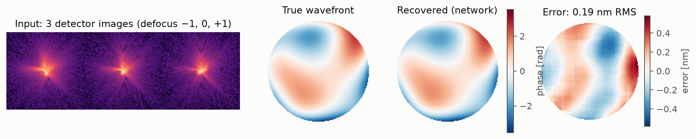</p>

### Results at a glance

The final model is an ensemble of 5 networks, evaluated on 1000 unseen test wavefronts. The aberrations it measures have a median of 2.73 nm RMS.

| | Final model |
|---|---|
| Median wavefront error | **0.102 nm RMS** (0.048 rad) |
| Strehl ratio after correction (Maréchal estimate) | **0.998** median; 100 % of samples meet the "diffraction-limited" λ/14 criterion |
| Recovered Zernike modes | 19 modes (Noll 4–22), each with **R² ≥ 0.990** |
| With 10× more detector noise | 0.108 nm RMS, Strehl 0.997 |
| Speed (Tesla T4) | 28 ms per sample for the ensemble, 5.6 ms for a single network |

---

## The problem: one image is not enough

A camera at the focus of the optics records the far-field diffraction pattern, i.e. the squared magnitude of the Fourier transform of the pupil field. The phase is lost in that squaring, and something worse happens too. For a round aperture, a wavefront φ and its **twin**, the same wavefront rotated by 180° with its sign flipped, −φ(−r), produce **exactly the same in-focus image**:

<p align="center">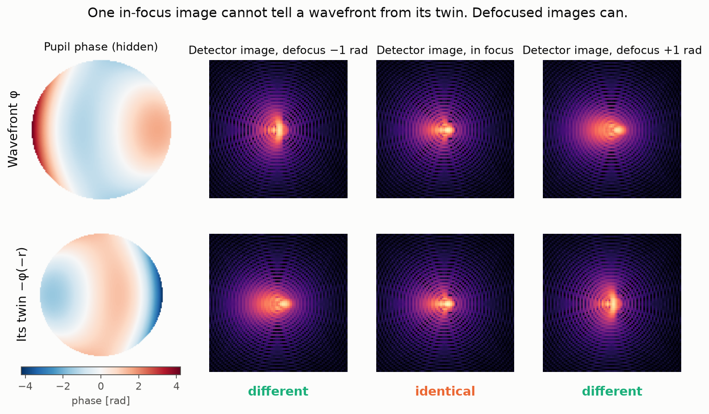</p>

So, from a single in-focus image, nobody can tell positive defocus from negative defocus, or one sign of astigmatism or spherical aberration from the other. The same holds for every "even" Zernike mode. The original model in this repository was trained on single images and did the only thing it could: it predicted **zero** for all of those modes (grey bars below). Its errors formed rings of 1–4 rad, and its uncertainty estimate could not flag the problem.

## The fix: phase diversity

Take two more images with a small, *known* amount of extra defocus (−1 and +1 rad RMS). The twin of φ seen through +1 rad of defocus looks like φ seen through −1 rad. The two stacks of images therefore differ, as the right-hand columns of the figure above show, and the ambiguity is gone. With three images, the network recovers every mode:

<p align="center">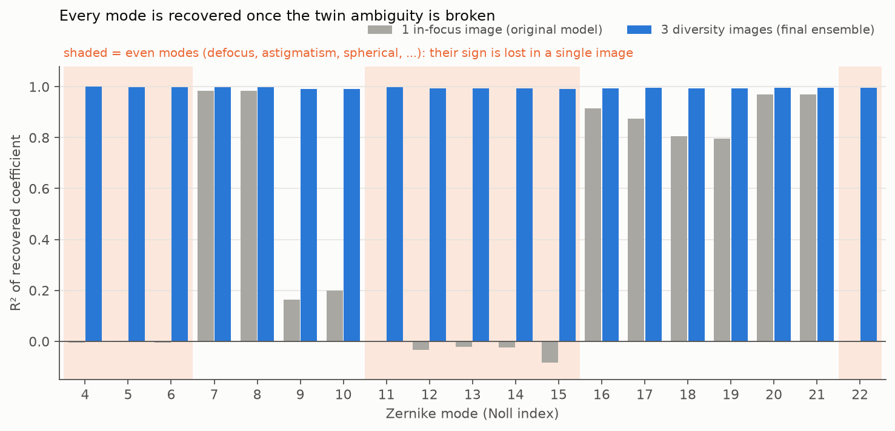</p>

How much defocus is needed was decided with a classical physics solver on 96 random wavefronts. With a single in-focus image it lands on the true wavefront only 47 % of the time, which is a coin flip. With three images at (−1, 0, +1) rad it converges to the truth **in 100 % of cases**, with a median error of 0.032 rad.

<details>
<summary>Diversity study: which defocus values and how many images</summary>

<p align="center">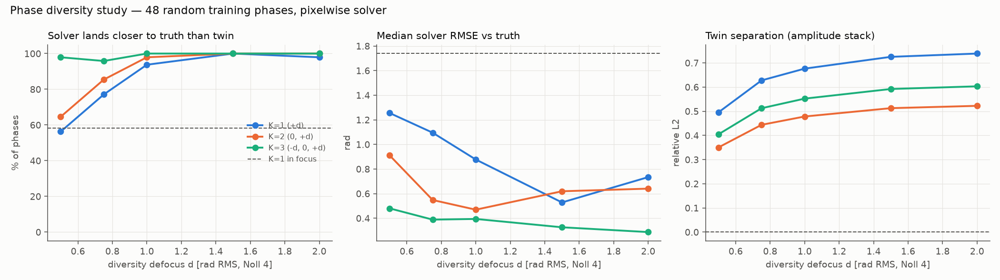</p>

- Two images (0, +1 rad) already reach 99 %.
- One defocused image is right 99 % of the time, but only 62 % of solves converge.
- More than 1 rad of defocus adds almost nothing.

The classical solver on the same astigmatism + coma wavefront, with one image (top) and with three (bottom):

<p align="center">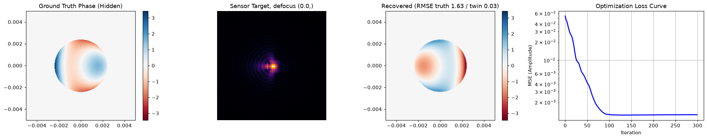<br>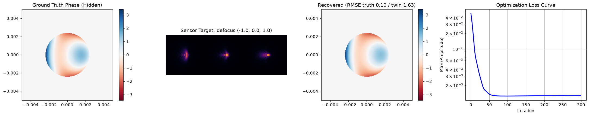</p>

With one image, truth and twin fit the data equally well. Which one the solver lands on is decided by floating-point noise, and here it is the twin (1.55 rad from the truth, 0.016 rad from the twin). With three images it recovers the truth (0.016 rad).
</details>

---

## Results

### Getting better step by step

<p align="center">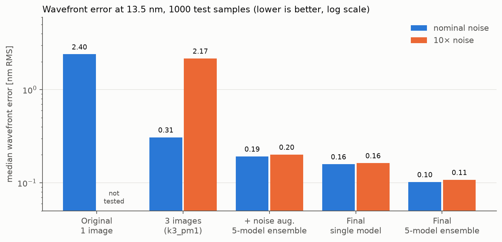</p>

| Model | R² odd / even modes | Worst mode | Median error, nominal noise | Median error, 10× noise |
|---|---|---|---|---|
| Original (1 image) | 0.77 / −0.02 | −0.08 | 2.40 nm | not tested |
| 3 images (`k3_pm1`) | 0.950 / 0.963 | 0.885 | 0.308 nm | 2.17 nm (breaks down) |
| + noise augmentation, 5-model ensemble (100 epochs) | 0.978 / 0.983 | 0.950 | 0.192 nm | 0.201 nm |
| **Final single model** (250 epochs) | 0.988 / 0.990 | 0.979 | 0.159 nm | 0.163 nm |
| **Final 5-model ensemble** | **0.995 / 0.996** | **0.990** | **0.102 nm** | **0.108 nm** |

What made the difference:
1. **Three images instead of one** removes the twin ambiguity.
2. **Training with randomly varied noise levels (1×–30×)** makes the model robust: the 3-image model trained at a single noise level collapses at 10× noise.
3. **A longer training run with more data:** 5× more samples per network (see [Training](#training-the-final-model)).
4. **Averaging 5 independently trained networks** cuts the error by a further third.

### Network vs. classical solver

<p align="center">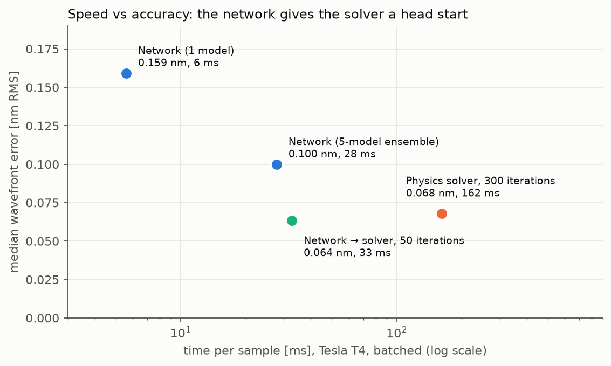</p>

| Method | Median error | Time per sample (T4, batched) |
|---|---|---|
| Network, 1 model | 0.159 nm | 5.6 ms |
| Network, 5-model ensemble | 0.100 nm | 27.8 ms |
| Physics solver, 300 iterations | 0.068 nm | 162 ms (0.73 s for a single sample) |
| **Network → solver, 50 iterations** | **0.064 nm** | **32.7 ms** |

The iterative physics solver is still the most accurate method on its own, but it is slow. Feeding the network's prediction to the solver as a starting point reaches the solver's accuracy **5× faster**. (Errors in this table are measured modulo 2π and without piston, on 256 test samples.)

### Uncertainty: when can the prediction be trusted?

The ensemble also reports an uncertainty σ: the spread of its five predictions. On test data, 74 % of the true phase values fall inside ±1σ and 94 % inside ±2σ, close to the ideal 68 % / 95 %, without any recalibration. The same holds at 10× noise (73 % / 93 %) and even at 100× noise, beyond the training range (67 % / 90 %).

<p align="center">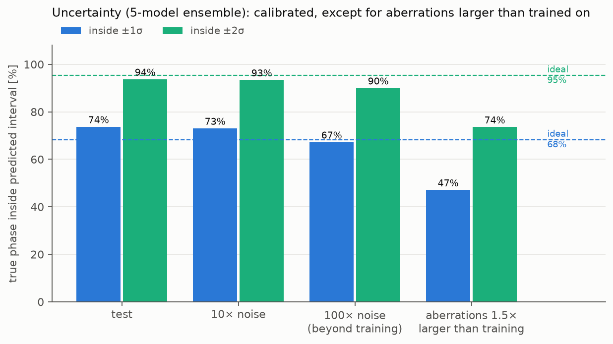</p>

**Where it falls short:** for aberrations 1.5× larger than anything seen in training, the error grows 4.4× but σ grows only 1.9×, so the intervals become too narrow (47 % / 74 %). σ still ranks which of those predictions are worst (Spearman 0.76), so it works as a warning signal, but its absolute size should not be trusted that far outside the training range. Adding Monte Carlo dropout on top widens the intervals enough out of distribution (76 % / 95 %), but then they are far too wide in distribution (98 % / 100 %). No variant tested was calibrated in both regimes.

<details>
<summary>More: reliability curves and an example with error bars</summary>

<p align="center">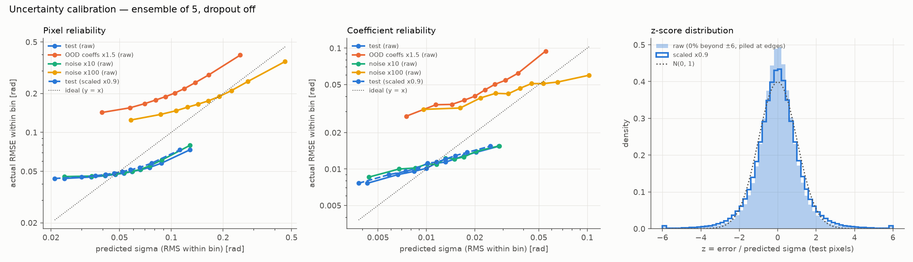</p>
<p align="center">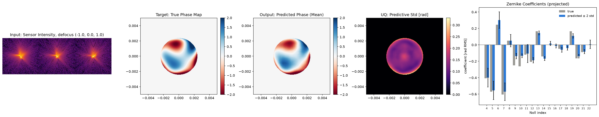</p>

This test sample has a coefficient error of 0.020 rad RMS, and 74 % of its coefficients lie within ±2σ. Trefoil (Noll 10) is the largest miss.
</details>

---

## How it works

**Simulator** (`physics/`). A circular pupil (123 pixels across a 256-pixel grid) carries the wavefront φ, built from 19 Noll-normalized Zernike modes. Each of the three images is the far-field intensity |FFT(pupil · e^{i(φ + d_k Z₄)})|² with diversity defocus d_k ∈ {−1, 0, +1} rad RMS, plus Gaussian detector noise. The grid samples the intensity just above the Nyquist limit (Q = N/D = 2.08 ≥ 2), so it does not alias.

**Network** (`ai/`). An 8.3 M-parameter attention U-Net with residual blocks takes the three images (center-cropped to 128×128, log-scaled and normalized together) and outputs the 256×256 phase map. It has two branches. One predicts the 19 Zernike coefficients directly. The other adds a pixel-level correction. Training data is generated on the fly, so the network never sees the same sample twice.

**Solver** (`solver/`). Plain gradient descent on the phase map through the same differentiable simulator. It fits all three images, with a small total-variation penalty inside the pupil.

<details>
<summary>The physics in equations</summary>

Detector image for diversity plane k:

$$I_k(\mathbf u) = \left| \mathcal F\left\{ P(\mathbf r)\, e^{\,i[\varphi(\mathbf r) + d_k Z_4(\mathbf r)]} \right\} \right|^2 + n$$

**Twin ambiguity.** For a real, centrosymmetric pupil $P$:

$$\mathcal F\{P\, e^{-i\varphi(-\mathbf r)}\} = \overline{\mathcal F\{P\, e^{i\varphi(\mathbf r)}\}} \;\Rightarrow\; \text{identical } |\cdot|^2.$$

A Zernike mode of azimuthal order m transforms as $Z \to -(-1)^m Z$ under $\varphi \to -\varphi(-\mathbf r)$. So all even-|m| modes flip sign together, and odd modes are unchanged.

**Diversity.** The twin of $\varphi + dZ_4$ is $-\varphi(-\mathbf r) - dZ_4$ ($Z_4$ is even). The image of φ at +d equals the image of the twin at −d, so an ordered stack of planes at different d separates them.

**Sampling.** The intensity is the autocorrelation of the pupil field, with support 2D − 1 pixels. It fits on the N-pixel grid without aliasing only if 2D − 1 ≤ N, i.e. Q = N/D ≥ 2. `OpticsConfig` refuses geometries that violate this.

**Units.** Wavefront error in nm = phase [rad] × 13.5 nm / 2π. Strehl ≈ exp(−σ²) (Maréchal), with σ the piston-free RMS phase error in rad.
</details>

### Training the final model

| | |
|---|---|
| Ensemble | 5 networks, seeds 0–4, trained one after another (`scripts/train_final.sh`) |
| Per network | 250 epochs × 4096 samples = 1,024,000 samples; batch 32 |
| Optimizer | AdamW, learning rate 3·10⁻⁴ with cosine decay to 10⁻⁶; full FP32 precision |
| Data | 3 planes at (−1, 0, +1) rad; detector noise varied randomly between 1× and 30× the nominal level |
| Validation | 1024 fixed samples (seed 12345) drawn from the training distribution, so with mixed noise levels. Reported test metrics use fixed noise levels instead. |
| Hardware and time | one NVIDIA Tesla T4; 30.9 GPU-hours in training epochs (31.0 h wall clock), 5.12 M samples in total |
| Result | best validation loss 0.0371 / 0.0390 / 0.0386 / 0.0372 / 0.0421, reached at epochs 241–250 |

The training logs are in `logs/final_m*.log`, and all evaluation outputs behind the numbers above are in `eval/`.

---

## Using it

### Pretrained models

The five final checkpoints are published as `final_models.zip` on the [v1.0 release](https://github.com/EstebanCardenas2001/EUV_phase_retrieval/releases/tag/v1.0) (about 155 MB). Unzip it into `saved_models/final/` and evaluate:

```bash
python ai/evaluate.py     --checkpoint saved_models/final/m*/best.pth --out-dir eval/my_check
python ai/inference_uq.py --checkpoint saved_models/final/m*/best.pth --mc-passes 0   # one sample -> uq_monte_carlo.png
```

### Setup

```bash
python -m venv .venv && source .venv/bin/activate
pip install -r requirements.txt
```

Run everything from the repository root.

### Train and evaluate

```bash
# Train one network (the final run used --epochs 250 --samples-per-epoch 4096 --val-samples 1024, seeds 0-4)
python ai/train.py --epochs 100 --samples-per-epoch 2048 --noise-aug-max 30 --seed 0 \
    --save-dir saved_models/<run> --progress-dir training_progress/<run>

# Evaluate (one checkpoint, or several to form an ensemble)
python ai/evaluate.py       --checkpoint saved_models/<run>/best.pth --out-dir eval/<run>                  # accuracy, nm, Strehl
python ai/evaluate.py       --checkpoint saved_models/<run>/best.pth --noise-mult 10 --out-dir eval/<run>_n10
python ai/uq_calibration.py --checkpoint saved_models/<run>/best.pth --out-dir eval/<run>                  # uncertainty
python ai/benchmark_speed.py --checkpoint saved_models/<run>/best.pth --out-dir eval/<run>_benchmark       # network vs solver

# Physics checks and figures
python solver/gradient_descent.py   # solver demo: error vs truth and vs twin
python ai/diversity_study.py        # which diversity defocus to use
python docs/make_figures.py         # regenerate the README figures from eval/
```

---

## Limitations and next steps

**Simulation only.** Everything here is trained and tested on simulated images: monochromatic light, Fraunhofer propagation, a uniformly lit circular pupil, and Gaussian detector noise. No real detector data has been used yet.

**Next steps** toward real measurements:
- **Fine-tune on real data** with a physics-consistency loss, comparing re-simulated images with the measured ones, so no ground-truth wavefront is needed.
- **Model photon (Poisson) noise** and a realistic photon budget.
- **Handle uncertainty in the diversity defocus** itself, since real defocus steps are never exact.
- **Support non-uniform and centrally obscured pupils,** which are common in EUV optics.
- **Improve uncertainty out of distribution**, e.g. using the mismatch between measured and re-simulated images as a trust score.

## Repository layout

```
physics/   config.py (OpticsConfig: geometry, modes, noise, diversity), simulator.py, zernike.py, grid.py
solver/    gradient_descent.py: classical multi-image phase retrieval
ai/        dataset.py, unet.py, train.py, checkpoint.py, ensemble.py,
           evaluate.py, uq_calibration.py, inference_uq.py, benchmark_speed.py, diversity_study.py, crop_energy.py
scripts/   train_final.sh, eval_final.sh: the final training run and its evaluation
eval/      evaluation outputs (JSON + plots) behind every number in this README
docs/      make_figures.py and the README figures
logs/      training and evaluation logs
```
